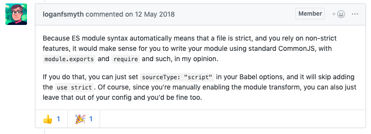

##! Code À La Mode

_Code À La Mode_ is one of company names that I came up when thinking of names for my software company, prior to getting the _Art Deco™_ insight. What I wanted to convey from the very beginning, is that modern code is beautiful, eloquent and practical. ES6 modules, async syntax and destructuring are the best features of JS, because they are so straight to the point as to what their purpose is, and just handsome to look at.

So after the final tipping point with _Babel_ I took some time to write my own transpiler, since that idea had long been in my head prior to that. But building ASTs, traversing them and generating code is too much effort. Programming must be practical, and like the language, solve problems at hand rather than build sand castles around standards and stuff. The second approach to transpilation is to actually use regular expressions, because imports are pretty much requires:

```js
import ArtDeco from      '@artdeco/stdlib'
const  ArtDeco = require('@artdeco/stdlib')

import { artdeco } from      '@artdeco/stdlib'
const  { artdeco } = require('@artdeco/stdlib')

import ArtDeco, { artdeco } from '@artdeco/stdlib'
const ArtDeco =         require ('@artdeco/stdlib'); const { artdeco } = ArtDeco
```

and exports are almost the same as assignments:

```js
export default class ArtDeco {}
module.exports =     ArtDeco {}

export const artdeco = () = {}
     exports.artdeco = () = {}
```

What's the point of all this intellectual exercise of making up random requirement like what the ES6 modules standard is for _Node.JS_ when all you have to do is to read the source code from a separate file? It probably is important in a browser, but who's ever going to use something like "async namespaces" in Node? Sure, regular expressions are probably not as robust as ASTs, but they also don't require installing 4k dependencies, and can be run in literally milliseconds! I've transpiled 100s of packages with _ÀLaMode_ now, and the only problem I encountered is due to the fact that I implemented it in such a way as to cut out comments, strings and regular expressions first, then paste them back to prevent false-positives, but when you have something like <code>const a = &#96;https://test.com&#96;</code> you might have a problem because the transpiler removes the comment first, and the opening backtick does not get balanced with its counter part, so that if there is another template literal later on in the file, what's between them will not be transpiled. OK that might be frustrating that it's not 100% accurate, but it's 100% practical, and I know of a way to overcome that, I just couldn't be bothered when all I can do is to write <code>'https:/' + '/test.com'</code>, or even better <code>url.format({ protocol: 'http', hostname: 'test.com' })</code> (since I had to use backticks, that means that the URL string needs to be formatted).

<plate alt="alamode transpilation example: clean code" src="img/one-year/alamode/alamode.png">[Example from Github](https://github.com/a-la/alamode#readme): all one has to do to enable modules, is to rename import into require, and export into the module.exports assignment. All `module.exports` are moved to the end of the file because otherwise you can't export a default declared after a named export.</plate>

<details>
<summary>Babel output? Here:

```js
"use strict";

Object.defineProperty(exports, "__esModule", {
  value: true
});
exports.b = exports.c = exports.default = void 0;

var _stream = _interopRequireWildcard(require("stream"));

var _path = require("path");

function _interopRequireWildcard(obj) { if (obj && obj.__esModule) { return obj; } else { var newObj = {}; if (obj != null) { for (var key in obj) { if (Object.prototype.hasOwnProperty.call(obj, key)) { var desc = Object.defineProperty && Object.getOwnPropertyDescriptor ? Object.getOwnPropertyDescriptor(obj, key) : {}; if (desc.get || desc.set) { Object.defineProperty(newObj, key, desc); } else { newObj[key] = obj[key]; } } } } newObj.default = obj; return newObj; } }

class S extends _stream.Transform {
// SHOW WHOLE FILE
```
</summary>

```js
"use strict";

Object.defineProperty(exports, "__esModule", {
  value: true
});
exports.b = exports.c = exports.default = void 0;

var _stream = _interopRequireWildcard(require("stream"));

var _path = require("path");

function _interopRequireWildcard(obj) { if (obj && obj.__esModule) { return obj; } else { var newObj = {}; if (obj != null) { for (var key in obj) { if (Object.prototype.hasOwnProperty.call(obj, key)) { var desc = Object.defineProperty && Object.getOwnPropertyDescriptor ? Object.getOwnPropertyDescriptor(obj, key) : {}; if (desc.get || desc.set) { Object.defineProperty(newObj, key, desc); } else { newObj[key] = obj[key]; } } } } newObj.default = obj; return newObj; } }

class S extends _stream.Transform {
  /**
   * Creates a new instance.
   * @param {string} path
   * @param {Stream} [parent]
   */
  constructor(path, parent) {
    super();
    this.source = (0, _path.join)('example', path);
    if (parent instanceof _stream.default) this.pipe(parent);
  }

}
/**
 * A function that returns `c`.
 * @param {string} input
 */


exports.default = S;

const c = (input = '') => {
  return 'c' + input ? `-${input}` : '';
};
/**
 * A function that returns `b`.
 * @param {number} times
 */


exports.c = c;

const b = (times = 0) => {
  return 'b' + times ? `-${times}` : '';
};

exports.b = b;
```
</details>

Which one looks better? Again, the *freedom* to just transpile code with minimal changes to enable modules which Node.JS cannot do, is taken away by _Babel_ that thinks it is entitled to append `;`, prepend `use strict;`, insert random interops, rearrange code and break _JSDoc_. So instead of just letting us use beautiful <code>import</code> syntax for the simplest task of dependency injection, _Node.JS_ and _Babel_ provoke a situation where we must use <del>free</del> software when its authors, who travel the world lobbying for standards, tell us you how we all must think. To clarify the comment below, the author is saying that I can configure the <code>use strict</code> in config, but if I use the modules transform, it is enabled automatically (and the way to disable it [is not documented](https://github.com/babel/babel/issues/7910)). In other words, even if I KNOW my code will be transpiled, I can't use <code>imports</code> in a non-strict file only because it's not a standard. All this standards-worshipping is so annoying.

<p></p>

<section-break section />