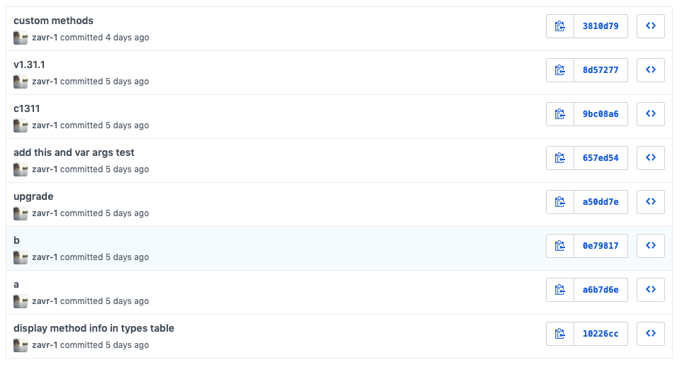

##! Hacks Vs Standards

I'm a strong advocate of practical programming, which means that you should not stuff your head with paradigms, methodologies and principles, and then go out of your way to follow them, even though they slow down the development process. For example, when I worked in London, "semantic commit messages" was introduced. This means that every commit should start with something like `fix: bla-bla`, `test: bla-bla`, and apparently because it's a convention, it's good. We even had it enforced with a git-hook that would add red cross if the message wasn't following the standard. But what happened was, when you published a package, you would get an automatic commit with `v1.2.3` by NPM or yarn, and when uploaded to GitHub, that would give you a red cross. So for those cases, developers had to undo the versioning commit, and update it with `chore: v1.2.3` message. That wasted at least 20s of everyone's time again and again.

<p></p>

When I started working on Open Source, I followed the employment-style convention, like writing extended git messages, making pull requests _etc_. Then I quickly realised I was wasting my time, so my commits now look something like that:

<p></p>

I do write some descriptions, but if it's a changelog it's like `c123`, a build &mdash; just `b`, some docs &mdash; `doc`, when I can't be asked it's `.` (I can't remember where I saw it but there was a repo of quite a big project where entire history of commits consisted of just `.`). I'm sure that's how most people do it as well on a single-person repo, but if you are still bothered with PRs, merges and proper English descriptions in your commits, you might consider using the time on adding a few additional tests/examples instead. I understand that it's not entirely appropriate for repos with more than one maintainer, my point being exactly that if you're doing it for yourself, don't create obstacles that will slow you down for no reason other than "conventions".

<block-quote>He that fears every bush must never go a-birding.</block-quote>

Another example was when I implemented a recursive select/recursive delete operations in the sql-generation library at work. Firstly, even without those operations the library that I wrote wasn't allowed to go through initially because of the fear that it might leave a possibility for SQL injection, despite the fact that it was only to be used for internal purposes. Secondly, if I just used an existing library which apparently was safe, I would have never been able to add the recursive functionality, which is essential when you want to create a testing database, then instead of dropping and bootstrapping it all over again for each test, you could just clear it, clear only a part of it, or even select a slice of the state for snapshot. Without recursive select/delete, you can't do that (recursive means that when you have a campaign with a client_id as foreign key, you can select a nested structure in one query, or delete both records without running into a constraint). However, the feature wasn't being merged in because of  caution that one of developers will one day drop an entire production database, with links being sent to [articles on Reddit](https://www.reddit.com/r/cscareerquestions/comments/6ez8ag/accidentally_destroyed_production_database_on/) how one person did it on day 1 at his new workplace.

<plate alt="fear word on fingers tattoo" responsive sizes="(min-width: 768px) 50vw" webp="photo" src="./img/fear.JPG">If there is a single tattoo that I would ever do, it's this one (saw it it a movie trailer 2 years ago, can't remember which one).</plate>

I don't think that it's possible that a 100GB production DB could have been accidentally dropped, because the recursive select for delete would probably take a few days to complete if the server didn't even blow up prior to that. So my reviewer and I met somewhere in the middle by adding a regex check against a part of the url-string of the prod database. Although it was a really good idea of my peer-reviewer that actually gave sense of security to everyone, I don't believe it's <ins>always</ins> "better safe than sorry", and sometimes too much fear stagnates and slows down the process. If the database was deleted, then there should be a process to quickly find out about it and put it back. Advantages need to be properly weighed against risks rather than assigning 100% red alert to every piece of code that deletes something.

<!-- The world doesn't stop there for a small company (small in HMRC sense, but big in [wonderfully amazing](https://amigotechnology.com/about-us/) sense) and  -->


As you could already have grasped, *freedom* is what I live for, and happiness for me is when your mind is free not only from outside influences, opinions, commentaries, but also from deep-rooted believes and "common sense" that we consider our own. When I passed out in the kitchen after a sleepless night without having any meals and opened my eyes to see the washing machine in front of me, completely disoriented, I was totally happy, I was blissful beyond words, because I didn't know where or who I was. It's pretty sad I have to pass out to be happy but it's what it is for most of us depressed humans. Then your mind kicks back in and takes over and you become its hostage to fear, anger (e.g., when such villains as _Tech Nation_ ruin your life) and other societal wirings. I always give this example and I feel sad for all so-called scholars/theologists who make theories about the nature of the world just to become prisoners of a virtual system &mdash; they will never know what happiness really is. Happiness is *freedom*, not freedom to choose, but freedom from the choices that we make (occasionally, I'd say somethings smart of funny and then feel like I stole that so pardon me if it's so 😔).

So I would suggest people start feeling less constrained by standards' apparition in order to go beyond what's normal and find out something _really_ new. OK let's get concrete now and how it all relates to software in question. The problem with not generating ASTs to build a transpiler, is that the professional software development for a mature project goes the following:

<ul>
  * go into your tests, and add a test case, i.e., the scenario that you want to either fix, or make possible;
  * then continue to implementation and add a rough sketch of how you think it can work. Do as much coding from head as you can without running the program;
  * run the focused test, see it fail with an error;
  * <strong>Set the debugging point at where it fails</strong>, and start the debugger;
  * when the debugger pauses, check the contents of variables, properties, _etc_ and see how the state of the program is different from what you expected when sketching it;
  * update the code, save it and your test should automatically rerun;
  * iterate; then run all tests to ensure nothing else broke (regression testing).
</ul>

You DON'T debug with `console.log`, manually calling `node program.js` after each change. `console.log` is only for really limited cases like when forking a process (even then VS Code apparently [can auto-attach](https://code.visualstudio.com/blogs/2018/07/12/introducing-logpoints-and-auto-attach#_autoattaching-to-node-processes) to a fork on the same debugging port but I never got that working). I know for some people that's obvious, but many developers don't know how to use debugger which is essential.

But the problem you will run into when using a regex-based transpiler, is that you cannot generate source maps, because a [source map is a collection of mappings](https://blog.bugsnag.com/source-maps/) of *entries* in source code to *entries* in the transpiled code, entries being variable names, properties, operators and everything else. Without this information, you can't have a source map, and without source map, when you debug in _VS Code_, your debugger won't open the source file, it will open the transpiled file in the read-only mode. You can't work like that and be efficient at the development process outlined above.

```js
// copyright bengourley
// https://gist.github.com/bengourley/c3c62e41c9b579ecc1d51e9d9eb8b9d2
"mappings": {
  "0": [
   ^
   └── the line number of the output file

    "231 => source.js 5:64 foo"
      ^        ^       ^    ^
      │        │       │    └── the symbol name from the source file
      │        │       │
      │        │       └── the line:column position in the source file
      │        │
      │        └── the name of the source file
      │
      └── the column number of the output file

  ]
}
```

Therefore, to generate a source map, you need to have an AST. Or do you? The answer is not necessary. I watched the news the other day, and there was an International Olympiad in Informatics happening recently. Olympic programming is a special kind of programming, you need to be like really smart, know all these algorithms, their Θ-s (running time as function of size of data) and how to solve algorithmic problems, so that's for special people with high IQ. I don't think I have high IQ, but solving problems in web-computing comes natural during a creative process, so practical coding is definitely more about being artistic and making something sleek by applying simple solutions that achieve results. You don't need to be smart, you just need to think outside the box and dismiss standards. The true task is to find a simple solution because there always is one.

<details mb-3>
<summary>
  So if we need a mapping, but don't have AST how do we go about solving this?</summary>
The answer is that we need to keep the line and column numbers intact when updating the imports into requires, so that then each line can be split by whitespace, and pretty much mapped onto itself! That's the only way to do it.<br>
<a href="http://sokra.github.io/source-map-visualization/#base64,Y29uc3QgeyBqb2luLCBiYXNlbmFtZSwgZGlybmFtZSB9ID0gcmVxdWlyZSgncGF0aCcpCmNvbnN0IHsgbHN0YXRTeW5jIH0gPSByZXF1aXJlKCdmcycpCmxldCByZWFkRGlyU3RydWN0dXJlID0gcmVxdWlyZSgnQHdyb3RlL3JlYWQtZGlyLXN0cnVjdHVyZScpOyBpZiAocmVhZERpclN0cnVjdHVyZSAmJiByZWFkRGlyU3RydWN0dXJlLl9fZXNNb2R1bGUpIHJlYWREaXJTdHJ1Y3R1cmUgPSByZWFkRGlyU3RydWN0dXJlLmRlZmF1bHQ7CmxldCBlbnN1cmVQYXRoID0gcmVxdWlyZSgnQHdyb3RlL2Vuc3VyZS1wYXRoJyk7IGlmIChlbnN1cmVQYXRoICYmIGVuc3VyZVBhdGguX19lc01vZHVsZSkgZW5zdXJlUGF0aCA9IGVuc3VyZVBhdGguZGVmYXVsdDsKY29uc3QgeyBkZWJ1Z2xvZyB9ID0gcmVxdWlyZSgndXRpbCcpCmNvbnN0IHsgY29weU1vZGUgfSA9IHJlcXVpcmUoJy4uL2xpYicpCmxldCB3cml0ZVNvdXJjZU1hcCA9IHJlcXVpcmUoJy4uL2xpYi9zb3VyY2UtbWFwJyk7IGlmICh3cml0ZVNvdXJjZU1hcCAmJiB3cml0ZVNvdXJjZU1hcC5fX2VzTW9kdWxlKSB3cml0ZVNvdXJjZU1hcCA9IHdyaXRlU291cmNlTWFwLmRlZmF1bHQ7CmNvbnN0IHsgdHJhbnNmb3JtU3RyZWFtIH0gPSByZXF1aXJlKCcuLi9saWIvdHJhbnNmb3JtJykKCmNvbnN0IExPRyA9IGRlYnVnbG9nKCdhbGFtb2RlJykKCmNvbnN0IHByb2Nlc3NGaWxlID0gYXN5bmMgKHsKICBpbnB1dCwgcmVsUGF0aCwgbmFtZSwgb3V0cHV0LCBpZ25vcmUsIG5vU291cmNlTWFwcywKfSkgPT4gewogIGNvbnN0IGZpbGUgPSBqb2luKHJlbFBhdGgsIG5hbWUpCiAgaWYgKGlnbm9yZS5pbmNsdWRlcyhmaWxlKSkgcmV0dXJuCgogIGNvbnN0IGlzT3V0cHV0U3Rkb3V0ID0gb3V0cHV0ID09ICctJwogIGNvbnN0IHNvdXJjZSA9IGpvaW4oaW5wdXQsIGZpbGUpCgogIGNvbnN0IG91dHB1dERpciA9IGlzT3V0cHV0U3Rkb3V0ID8gbnVsbCA6IGpvaW4ob3V0cHV0LCByZWxQYXRoKQogIGNvbnN0IGRlc3RpbmF0aW9uID0gaXNPdXRwdXRTdGRvdXQgPyAnLScgOiBqb2luKG91dHB1dERpciwgbmFtZSkKICBMT0coZmlsZSkKCiAgYXdhaXQgZW5zdXJlUGF0aChkZXN0aW5hdGlvbikKCiAgY29uc3Qgb3JpZ2luYWxTb3VyY2UgPSBhd2FpdCB0cmFuc2Zvcm1TdHJlYW0oewogICAgc291cmNlLAogICAgZGVzdGluYXRpb24sCiAgfSkKCiAgaWYgKG91dHB1dCAhPSAnLScpIHsKICAgIGNvcHlNb2RlKHNvdXJjZSwgZGVzdGluYXRpb24pCiAgICBpZiAobm9Tb3VyY2VNYXBzKSByZXR1cm4KICAgIHdyaXRlU291cmNlTWFwKHsKICAgICAgZGVzdGluYXRpb24sCiAgICAgIGZpbGUsCiAgICAgIG5hbWUsCiAgICAgIG91dHB1dERpciwKICAgICAgc291cmNlLAogICAgICBvcmlnaW5hbFNvdXJjZSwKICAgIH0pCiAgfQp9Cgpjb25zdCBwcm9jZXNzRGlyID0gYXN5bmMgKHsKICBpbnB1dCwKICBvdXRwdXQsCiAgcmVsUGF0aCA9ICcuJywKICBpZ25vcmUgPSBbXSwKICBub1NvdXJjZU1hcHMsCn0pID0+IHsKICBjb25zdCBwYXRoID0gam9pbihpbnB1dCwgcmVsUGF0aCkKICBjb25zdCB7IGNvbnRlbnQgfSA9IGF3YWl0IHJlYWREaXJTdHJ1Y3R1cmUocGF0aCkKICBjb25zdCBrID0gT2JqZWN0LmtleXMoY29udGVudCkKICBhd2FpdCBrLnJlZHVjZShhc3luYyAoYWNjLCBuYW1lKSA9PiB7CiAgICBhd2FpdCBhY2MKICAgIGNvbnN0IHsgdHlwZSB9ID0gY29udGVudFtuYW1lXQogICAgaWYgKHR5cGUgPT0gJ0ZpbGUnKSB7CiAgICAgIGF3YWl0IHByb2Nlc3NGaWxlKHsKICAgICAgICBpbnB1dCwgcmVsUGF0aCwgbmFtZSwgb3V0cHV0LCBpZ25vcmUsIG5vU291cmNlTWFwcywKICAgICAgfSkKICAgIH0gZWxzZSBpZiAodHlwZSA9PSAnRGlyZWN0b3J5JykgewogICAgICBjb25zdCBuZXdSZWxQYXRoID0gam9pbihyZWxQYXRoLCBuYW1lKQogICAgICBhd2FpdCBwcm9jZXNzRGlyKHsKICAgICAgICBpbnB1dCwKICAgICAgICBvdXRwdXQsCiAgICAgICAgaWdub3JlLAogICAgICAgIHJlbFBhdGg6IG5ld1JlbFBhdGgsCiAgICAgICAgbm9Tb3VyY2VNYXBzLAogICAgICB9KQogICAgfQogIH0sIFByb21pc2UucmVzb2x2ZSgpKQp9CgogICAgICAgY29uc3QgdHJhbnNwaWxlID0gYXN5bmMgKHsKICBpbnB1dCwKICBvdXRwdXQgPSAnLScsCiAgaWdub3JlID0gW10sCiAgbm9Tb3VyY2VNYXBzLAp9KSA9PiB7CiAgaWYgKCFpbnB1dCkgdGhyb3cgbmV3IEVycm9yKCdQbGVhc2Ugc3BlY2lmeSB0aGUgc291cmNlIGZpbGUgb3IgZGlyZWN0b3J5LicpCgogIGNvbnN0IGxzID0gbHN0YXRTeW5jKGlucHV0KQogIGlmIChscy5pc0RpcmVjdG9yeSgpKSB7CiAgICBpZiAoIW91dHB1dCkgdGhyb3cgbmV3IEVycm9yKCdQbGVhc2Ugc3BlY2lmeSB0aGUgb3V0cHV0IGRpcmVjdG9yeS4nKQogICAgYXdhaXQgcHJvY2Vzc0Rpcih7CiAgICAgIGlucHV0LAogICAgICBvdXRwdXQsCiAgICAgIGlnbm9yZSwKICAgICAgbm9Tb3VyY2VNYXBzLAogICAgfSkKICB9IGVsc2UgaWYgKGxzLmlzRmlsZSgpKSB7CiAgICBhd2FpdCBwcm9jZXNzRmlsZSh7CiAgICAgIGlucHV0OiBkaXJuYW1lKGlucHV0KSwKICAgICAgcmVsUGF0aDogJy4nLAogICAgICBuYW1lOiBiYXNlbmFtZShpbnB1dCksCiAgICAgIG91dHB1dCwKICAgICAgaWdub3JlLAogICAgICBub1NvdXJjZU1hcHMsCiAgICB9KQogIH0KICBpZiAob3V0cHV0ICE9ICctJykgcHJvY2Vzcy5zdGRvdXQud3JpdGUoYFRyYW5zcGlsZWQgY29kZSBzYXZlZCB0byAke291dHB1dH1cbmApCn0KCgptb2R1bGUuZXhwb3J0cy50cmFuc3BpbGUgPSB0cmFuc3BpbGUKLy8jIHNvdXJjZU1hcHBpbmdVUkw9dHJhbnNwaWxlLmpzLm1hcA==,eyJ2ZXJzaW9uIjozLCJzb3VyY2VzIjpbIi4uLy4uL3NyYy9iaW4vdHJhbnNwaWxlLmpzIl0sIm5hbWVzIjpbXSwibWFwcGluZ3MiOiJBQUFBLE1BQU0sQ0FBQyxDQUFDLENBQUMsSUFBSSxDQUFDLENBQUMsUUFBUSxDQUFDLENBQUMsT0FBTyxDQUFDLENBQUMsQ0FBQyxJQUFJLENBQUMsQ0FBQyxJQUFJO0FBQzdDLE1BQU0sQ0FBQyxDQUFDLENBQUMsU0FBUyxDQUFDLENBQUMsQ0FBQyxJQUFJLENBQUMsQ0FBQyxFQUFFO0FBQzdCLE1BQU0sQ0FBQyxnQkFBZ0IsQ0FBQyxJQUFJLENBQUMsQ0FBQyxDQUFDLEtBQUssQ0FBQyxJQUFJLENBQUMsR0FBRyxDQUFDLFNBQVM7QUFDdkQsTUFBTSxDQUFDLFVBQVUsQ0FBQyxJQUFJLENBQUMsQ0FBQyxDQUFDLEtBQUssQ0FBQyxNQUFNLENBQUMsSUFBSTtBQUMxQyxNQUFNLENBQUMsQ0FBQyxDQUFDLFFBQVEsQ0FBQyxDQUFDLENBQUMsSUFBSSxDQUFDLENBQUMsSUFBSTtBQUM5QixNQUFNLENBQUMsQ0FBQyxDQUFDLFFBQVEsQ0FBQyxDQUFDLENBQUMsSUFBSSxDQUFDLENBQUMsQ0FBQyxDQUFDLENBQUMsR0FBRztBQUNoQyxNQUFNLENBQUMsY0FBYyxDQUFDLElBQUksQ0FBQyxDQUFDLENBQUMsQ0FBQyxDQUFDLEdBQUcsQ0FBQyxNQUFNLENBQUMsR0FBRztBQUM3QyxNQUFNLENBQUMsQ0FBQyxDQUFDLGVBQWUsQ0FBQyxDQUFDLENBQUMsSUFBSSxDQUFDLENBQUMsQ0FBQyxDQUFDLENBQUMsR0FBRyxDQUFDLFNBQVM7O0FBRWpELEtBQUssQ0FBQyxHQUFHLENBQUMsQ0FBQyxDQUFDLFFBQVEsQ0FBQyxDQUFDLE9BQU8sQ0FBQzs7QUFFOUIsS0FBSyxDQUFDLFdBQVcsQ0FBQyxDQUFDLENBQUMsS0FBSyxDQUFDLENBQUM7RUFDekIsS0FBSyxDQUFDLENBQUMsT0FBTyxDQUFDLENBQUMsSUFBSSxDQUFDLENBQUMsTUFBTSxDQUFDLENBQUMsTUFBTSxDQUFDLENBQUMsWUFBWTtBQUNwRCxDQUFDLENBQUMsQ0FBQyxDQUFDLENBQUMsQ0FBQztFQUNKLEtBQUssQ0FBQyxJQUFJLENBQUMsQ0FBQyxDQUFDLElBQUksQ0FBQyxPQUFPLENBQUMsQ0FBQyxJQUFJO0VBQy9CLEVBQUUsQ0FBQyxDQUFDLE1BQU0sQ0FBQyxRQUFRLENBQUMsSUFBSSxDQUFDLENBQUMsQ0FBQzs7RUFFM0IsS0FBSyxDQUFDLGNBQWMsQ0FBQyxDQUFDLENBQUMsTUFBTSxDQUFDLENBQUMsQ0FBQyxDQUFDLENBQUMsQ0FBQztFQUNuQyxLQUFLLENBQUMsTUFBTSxDQUFDLENBQUMsQ0FBQyxJQUFJLENBQUMsS0FBSyxDQUFDLENBQUMsSUFBSTs7RUFFL0IsS0FBSyxDQUFDLFNBQVMsQ0FBQyxDQUFDLENBQUMsY0FBYyxDQUFDLENBQUMsQ0FBQyxJQUFJLENBQUMsQ0FBQyxDQUFDLElBQUksQ0FBQyxNQUFNLENBQUMsQ0FBQyxPQUFPO0VBQzlELEtBQUssQ0FBQyxXQUFXLENBQUMsQ0FBQyxDQUFDLGNBQWMsQ0FBQyxDQUFDLENBQUMsQ0FBQyxDQUFDLENBQUMsQ0FBQyxDQUFDLENBQUMsSUFBSSxDQUFDLFNBQVMsQ0FBQyxDQUFDLElBQUk7RUFDL0QsR0FBRyxDQUFDLElBQUk7O0VBRVIsS0FBSyxDQUFDLFVBQVUsQ0FBQyxXQUFXOztFQUU1QixLQUFLLENBQUMsY0FBYyxDQUFDLENBQUMsQ0FBQyxLQUFLLENBQUMsZUFBZSxDQUFDO0lBQzNDLE1BQU07SUFDTixXQUFXO0VBQ2IsQ0FBQzs7RUFFRCxFQUFFLENBQUMsQ0FBQyxNQUFNLENBQUMsQ0FBQyxDQUFDLENBQUMsQ0FBQyxDQUFDLENBQUMsQ0FBQyxDQUFDO0lBQ2pCLFFBQVEsQ0FBQyxNQUFNLENBQUMsQ0FBQyxXQUFXO0lBQzVCLEVBQUUsQ0FBQyxDQUFDLFlBQVksQ0FBQyxDQUFDO0lBQ2xCLGNBQWMsQ0FBQztNQUNiLFdBQVc7TUFDWCxJQUFJO01BQ0osSUFBSTtNQUNKLFNBQVM7TUFDVCxNQUFNO01BQ04sY0FBYztJQUNoQixDQUFDO0VBQ0g7QUFDRjs7QUFFQSxLQUFLLENBQUMsVUFBVSxDQUFDLENBQUMsQ0FBQyxLQUFLLENBQUMsQ0FBQztFQUN4QixLQUFLO0VBQ0wsTUFBTTtFQUNOLE9BQU8sQ0FBQyxDQUFDLENBQUMsQ0FBQyxDQUFDLENBQUM7RUFDYixNQUFNLENBQUMsQ0FBQyxDQUFDLENBQUMsQ0FBQztFQUNYLFlBQVk7QUFDZCxDQUFDLENBQUMsQ0FBQyxDQUFDLENBQUMsQ0FBQztFQUNKLEtBQUssQ0FBQyxJQUFJLENBQUMsQ0FBQyxDQUFDLElBQUksQ0FBQyxLQUFLLENBQUMsQ0FBQyxPQUFPO0VBQ2hDLEtBQUssQ0FBQyxDQUFDLENBQUMsT0FBTyxDQUFDLENBQUMsQ0FBQyxDQUFDLENBQUMsS0FBSyxDQUFDLGdCQUFnQixDQUFDLElBQUk7RUFDL0MsS0FBSyxDQUFDLENBQUMsQ0FBQyxDQUFDLENBQUMsTUFBTSxDQUFDLElBQUksQ0FBQyxPQUFPO0VBQzdCLEtBQUssQ0FBQyxDQUFDLENBQUMsTUFBTSxDQUFDLEtBQUssQ0FBQyxDQUFDLEdBQUcsQ0FBQyxDQUFDLElBQUksQ0FBQyxDQUFDLENBQUMsQ0FBQyxDQUFDO0lBQ2xDLEtBQUssQ0FBQztJQUNOLEtBQUssQ0FBQyxDQUFDLENBQUMsSUFBSSxDQUFDLENBQUMsQ0FBQyxDQUFDLENBQUMsT0FBTyxDQUFDLElBQUk7SUFDN0IsRUFBRSxDQUFDLENBQUMsSUFBSSxDQUFDLENBQUMsQ0FBQyxDQUFDLENBQUMsSUFBSSxDQUFDLENBQUMsQ0FBQztNQUNsQixLQUFLLENBQUMsV0FBVyxDQUFDO1FBQ2hCLEtBQUssQ0FBQyxDQUFDLE9BQU8sQ0FBQyxDQUFDLElBQUksQ0FBQyxDQUFDLE1BQU0sQ0FBQyxDQUFDLE1BQU0sQ0FBQyxDQUFDLFlBQVk7TUFDcEQsQ0FBQztJQUNILENBQUMsQ0FBQyxJQUFJLENBQUMsRUFBRSxDQUFDLENBQUMsSUFBSSxDQUFDLENBQUMsQ0FBQyxDQUFDLENBQUMsU0FBUyxDQUFDLENBQUMsQ0FBQztNQUM5QixLQUFLLENBQUMsVUFBVSxDQUFDLENBQUMsQ0FBQyxJQUFJLENBQUMsT0FBTyxDQUFDLENBQUMsSUFBSTtNQUNyQyxLQUFLLENBQUMsVUFBVSxDQUFDO1FBQ2YsS0FBSztRQUNMLE1BQU07UUFDTixNQUFNO1FBQ04sT0FBTyxDQUFDLENBQUMsVUFBVTtRQUNuQixZQUFZO01BQ2QsQ0FBQztJQUNIO0VBQ0YsQ0FBQyxDQUFDLENBQUMsT0FBTyxDQUFDLE9BQU8sQ0FBQyxDQUFDO0FBQ3RCOztBQUVBLE1BQU0sQ0FBQyxLQUFLLENBQUMsU0FBUyxDQUFDLENBQUMsQ0FBQyxLQUFLLENBQUMsQ0FBQztFQUM5QixLQUFLO0VBQ0wsTUFBTSxDQUFDLENBQUMsQ0FBQyxDQUFDLENBQUMsQ0FBQztFQUNaLE1BQU0sQ0FBQyxDQUFDLENBQUMsQ0FBQyxDQUFDO0VBQ1gsWUFBWTtBQUNkLENBQUMsQ0FBQyxDQUFDLENBQUMsQ0FBQyxDQUFDO0VBQ0osRUFBRSxDQUFDLENBQUMsQ0FBQyxLQUFLLENBQUMsQ0FBQyxLQUFLLENBQUMsR0FBRyxDQUFDLEtBQUssQ0FBQyxDQUFDLE1BQU0sQ0FBQyxPQUFPLENBQUMsR0FBRyxDQUFDLE1BQU0sQ0FBQyxJQUFJLENBQUMsRUFBRSxDQUFDLFNBQVMsQ0FBQyxDQUFDOztFQUUxRSxLQUFLLENBQUMsRUFBRSxDQUFDLENBQUMsQ0FBQyxTQUFTLENBQUMsS0FBSztFQUMxQixFQUFFLENBQUMsQ0FBQyxFQUFFLENBQUMsV0FBVyxDQUFDLENBQUMsQ0FBQyxDQUFDO0lBQ3BCLEVBQUUsQ0FBQyxDQUFDLENBQUMsTUFBTSxDQUFDLENBQUMsS0FBSyxDQUFDLEdBQUcsQ0FBQyxLQUFLLENBQUMsQ0FBQyxNQUFNLENBQUMsT0FBTyxDQUFDLEdBQUcsQ0FBQyxNQUFNLENBQUMsU0FBUyxDQUFDLENBQUM7SUFDbkUsS0FBSyxDQUFDLFVBQVUsQ0FBQztNQUNmLEtBQUs7TUFDTCxNQUFNO01BQ04sTUFBTTtNQUNOLFlBQVk7SUFDZCxDQUFDO0VBQ0gsQ0FBQyxDQUFDLElBQUksQ0FBQyxFQUFFLENBQUMsQ0FBQyxFQUFFLENBQUMsTUFBTSxDQUFDLENBQUMsQ0FBQyxDQUFDO0lBQ3RCLEtBQUssQ0FBQyxXQUFXLENBQUM7TUFDaEIsS0FBSyxDQUFDLENBQUMsT0FBTyxDQUFDLEtBQUssQ0FBQztNQUNyQixPQUFPLENBQUMsQ0FBQyxDQUFDLENBQUMsQ0FBQztNQUNaLElBQUksQ0FBQyxDQUFDLFFBQVEsQ0FBQyxLQUFLLENBQUM7TUFDckIsTUFBTTtNQUNOLE1BQU07TUFDTixZQUFZO0lBQ2QsQ0FBQztFQUNIO0VBQ0EsRUFBRSxDQUFDLENBQUMsTUFBTSxDQUFDLENBQUMsQ0FBQyxDQUFDLENBQUMsQ0FBQyxDQUFDLENBQUMsQ0FBQyxPQUFPLENBQUMsTUFBTSxDQUFDLEtBQUssQ0FBQyxDQUFDLFVBQVUsQ0FBQyxJQUFJLENBQUMsS0FBSyxDQUFDLEVBQUUsQ0FBQyxDQUFDLENBQUMsTUFBTSxDQUFDLENBQUMsQ0FBQyxDQUFDO0FBQ2hGIiwiZmlsZSI6ImJpbi90cmFuc3BpbGUuanMiLCJzb3VyY2VzQ29udGVudCI6WyJpbXBvcnQgeyBqb2luLCBiYXNlbmFtZSwgZGlybmFtZSB9IGZyb20gJ3BhdGgnXG5pbXBvcnQgeyBsc3RhdFN5bmMgfSBmcm9tICdmcydcbmltcG9ydCByZWFkRGlyU3RydWN0dXJlIGZyb20gJ0B3cm90ZS9yZWFkLWRpci1zdHJ1Y3R1cmUnXG5pbXBvcnQgZW5zdXJlUGF0aCBmcm9tICdAd3JvdGUvZW5zdXJlLXBhdGgnXG5pbXBvcnQgeyBkZWJ1Z2xvZyB9IGZyb20gJ3V0aWwnXG5pbXBvcnQgeyBjb3B5TW9kZSB9IGZyb20gJy4uL2xpYidcbmltcG9ydCB3cml0ZVNvdXJjZU1hcCBmcm9tICcuLi9saWIvc291cmNlLW1hcCdcbmltcG9ydCB7IHRyYW5zZm9ybVN0cmVhbSB9IGZyb20gJy4uL2xpYi90cmFuc2Zvcm0nXG5cbmNvbnN0IExPRyA9IGRlYnVnbG9nKCdhbGFtb2RlJylcblxuY29uc3QgcHJvY2Vzc0ZpbGUgPSBhc3luYyAoe1xuICBpbnB1dCwgcmVsUGF0aCwgbmFtZSwgb3V0cHV0LCBpZ25vcmUsIG5vU291cmNlTWFwcyxcbn0pID0+IHtcbiAgY29uc3QgZmlsZSA9IGpvaW4ocmVsUGF0aCwgbmFtZSlcbiAgaWYgKGlnbm9yZS5pbmNsdWRlcyhmaWxlKSkgcmV0dXJuXG5cbiAgY29uc3QgaXNPdXRwdXRTdGRvdXQgPSBvdXRwdXQgPT0gJy0nXG4gIGNvbnN0IHNvdXJjZSA9IGpvaW4oaW5wdXQsIGZpbGUpXG5cbiAgY29uc3Qgb3V0cHV0RGlyID0gaXNPdXRwdXRTdGRvdXQgPyBudWxsIDogam9pbihvdXRwdXQsIHJlbFBhdGgpXG4gIGNvbnN0IGRlc3RpbmF0aW9uID0gaXNPdXRwdXRTdGRvdXQgPyAnLScgOiBqb2luKG91dHB1dERpciwgbmFtZSlcbiAgTE9HKGZpbGUpXG5cbiAgYXdhaXQgZW5zdXJlUGF0aChkZXN0aW5hdGlvbilcblxuICBjb25zdCBvcmlnaW5hbFNvdXJjZSA9IGF3YWl0IHRyYW5zZm9ybVN0cmVhbSh7XG4gICAgc291cmNlLFxuICAgIGRlc3RpbmF0aW9uLFxuICB9KVxuXG4gIGlmIChvdXRwdXQgIT0gJy0nKSB7XG4gICAgY29weU1vZGUoc291cmNlLCBkZXN0aW5hdGlvbilcbiAgICBpZiAobm9Tb3VyY2VNYXBzKSByZXR1cm5cbiAgICB3cml0ZVNvdXJjZU1hcCh7XG4gICAgICBkZXN0aW5hdGlvbixcbiAgICAgIGZpbGUsXG4gICAgICBuYW1lLFxuICAgICAgb3V0cHV0RGlyLFxuICAgICAgc291cmNlLFxuICAgICAgb3JpZ2luYWxTb3VyY2UsXG4gICAgfSlcbiAgfVxufVxuXG5jb25zdCBwcm9jZXNzRGlyID0gYXN5bmMgKHtcbiAgaW5wdXQsXG4gIG91dHB1dCxcbiAgcmVsUGF0aCA9ICcuJyxcbiAgaWdub3JlID0gW10sXG4gIG5vU291cmNlTWFwcyxcbn0pID0+IHtcbiAgY29uc3QgcGF0aCA9IGpvaW4oaW5wdXQsIHJlbFBhdGgpXG4gIGNvbnN0IHsgY29udGVudCB9ID0gYXdhaXQgcmVhZERpclN0cnVjdHVyZShwYXRoKVxuICBjb25zdCBrID0gT2JqZWN0LmtleXMoY29udGVudClcbiAgYXdhaXQgay5yZWR1Y2UoYXN5bmMgKGFjYywgbmFtZSkgPT4ge1xuICAgIGF3YWl0IGFjY1xuICAgIGNvbnN0IHsgdHlwZSB9ID0gY29udGVudFtuYW1lXVxuICAgIGlmICh0eXBlID09ICdGaWxlJykge1xuICAgICAgYXdhaXQgcHJvY2Vzc0ZpbGUoe1xuICAgICAgICBpbnB1dCwgcmVsUGF0aCwgbmFtZSwgb3V0cHV0LCBpZ25vcmUsIG5vU291cmNlTWFwcyxcbiAgICAgIH0pXG4gICAgfSBlbHNlIGlmICh0eXBlID09ICdEaXJlY3RvcnknKSB7XG4gICAgICBjb25zdCBuZXdSZWxQYXRoID0gam9pbihyZWxQYXRoLCBuYW1lKVxuICAgICAgYXdhaXQgcHJvY2Vzc0Rpcih7XG4gICAgICAgIGlucHV0LFxuICAgICAgICBvdXRwdXQsXG4gICAgICAgIGlnbm9yZSxcbiAgICAgICAgcmVsUGF0aDogbmV3UmVsUGF0aCxcbiAgICAgICAgbm9Tb3VyY2VNYXBzLFxuICAgICAgfSlcbiAgICB9XG4gIH0sIFByb21pc2UucmVzb2x2ZSgpKVxufVxuXG5leHBvcnQgY29uc3QgdHJhbnNwaWxlID0gYXN5bmMgKHtcbiAgaW5wdXQsXG4gIG91dHB1dCA9ICctJyxcbiAgaWdub3JlID0gW10sXG4gIG5vU291cmNlTWFwcyxcbn0pID0+IHtcbiAgaWYgKCFpbnB1dCkgdGhyb3cgbmV3IEVycm9yKCdQbGVhc2Ugc3BlY2lmeSB0aGUgc291cmNlIGZpbGUgb3IgZGlyZWN0b3J5LicpXG5cbiAgY29uc3QgbHMgPSBsc3RhdFN5bmMoaW5wdXQpXG4gIGlmIChscy5pc0RpcmVjdG9yeSgpKSB7XG4gICAgaWYgKCFvdXRwdXQpIHRocm93IG5ldyBFcnJvcignUGxlYXNlIHNwZWNpZnkgdGhlIG91dHB1dCBkaXJlY3RvcnkuJylcbiAgICBhd2FpdCBwcm9jZXNzRGlyKHtcbiAgICAgIGlucHV0LFxuICAgICAgb3V0cHV0LFxuICAgICAgaWdub3JlLFxuICAgICAgbm9Tb3VyY2VNYXBzLFxuICAgIH0pXG4gIH0gZWxzZSBpZiAobHMuaXNGaWxlKCkpIHtcbiAgICBhd2FpdCBwcm9jZXNzRmlsZSh7XG4gICAgICBpbnB1dDogZGlybmFtZShpbnB1dCksXG4gICAgICByZWxQYXRoOiAnLicsXG4gICAgICBuYW1lOiBiYXNlbmFtZShpbnB1dCksXG4gICAgICBvdXRwdXQsXG4gICAgICBpZ25vcmUsXG4gICAgICBub1NvdXJjZU1hcHMsXG4gICAgfSlcbiAgfVxuICBpZiAob3V0cHV0ICE9ICctJykgcHJvY2Vzcy5zdGRvdXQud3JpdGUoYFRyYW5zcGlsZWQgY29kZSBzYXZlZCB0byAke291dHB1dH1cXG5gKVxufVxuIl19,aW1wb3J0IHsgam9pbiwgYmFzZW5hbWUsIGRpcm5hbWUgfSBmcm9tICdwYXRoJwppbXBvcnQgeyBsc3RhdFN5bmMgfSBmcm9tICdmcycKaW1wb3J0IHJlYWREaXJTdHJ1Y3R1cmUgZnJvbSAnQHdyb3RlL3JlYWQtZGlyLXN0cnVjdHVyZScKaW1wb3J0IGVuc3VyZVBhdGggZnJvbSAnQHdyb3RlL2Vuc3VyZS1wYXRoJwppbXBvcnQgeyBkZWJ1Z2xvZyB9IGZyb20gJ3V0aWwnCmltcG9ydCB7IGNvcHlNb2RlIH0gZnJvbSAnLi4vbGliJwppbXBvcnQgd3JpdGVTb3VyY2VNYXAgZnJvbSAnLi4vbGliL3NvdXJjZS1tYXAnCmltcG9ydCB7IHRyYW5zZm9ybVN0cmVhbSB9IGZyb20gJy4uL2xpYi90cmFuc2Zvcm0nCgpjb25zdCBMT0cgPSBkZWJ1Z2xvZygnYWxhbW9kZScpCgpjb25zdCBwcm9jZXNzRmlsZSA9IGFzeW5jICh7CiAgaW5wdXQsIHJlbFBhdGgsIG5hbWUsIG91dHB1dCwgaWdub3JlLCBub1NvdXJjZU1hcHMsCn0pID0+IHsKICBjb25zdCBmaWxlID0gam9pbihyZWxQYXRoLCBuYW1lKQogIGlmIChpZ25vcmUuaW5jbHVkZXMoZmlsZSkpIHJldHVybgoKICBjb25zdCBpc091dHB1dFN0ZG91dCA9IG91dHB1dCA9PSAnLScKICBjb25zdCBzb3VyY2UgPSBqb2luKGlucHV0LCBmaWxlKQoKICBjb25zdCBvdXRwdXREaXIgPSBpc091dHB1dFN0ZG91dCA/IG51bGwgOiBqb2luKG91dHB1dCwgcmVsUGF0aCkKICBjb25zdCBkZXN0aW5hdGlvbiA9IGlzT3V0cHV0U3Rkb3V0ID8gJy0nIDogam9pbihvdXRwdXREaXIsIG5hbWUpCiAgTE9HKGZpbGUpCgogIGF3YWl0IGVuc3VyZVBhdGgoZGVzdGluYXRpb24pCgogIGNvbnN0IG9yaWdpbmFsU291cmNlID0gYXdhaXQgdHJhbnNmb3JtU3RyZWFtKHsKICAgIHNvdXJjZSwKICAgIGRlc3RpbmF0aW9uLAogIH0pCgogIGlmIChvdXRwdXQgIT0gJy0nKSB7CiAgICBjb3B5TW9kZShzb3VyY2UsIGRlc3RpbmF0aW9uKQogICAgaWYgKG5vU291cmNlTWFwcykgcmV0dXJuCiAgICB3cml0ZVNvdXJjZU1hcCh7CiAgICAgIGRlc3RpbmF0aW9uLAogICAgICBmaWxlLAogICAgICBuYW1lLAogICAgICBvdXRwdXREaXIsCiAgICAgIHNvdXJjZSwKICAgICAgb3JpZ2luYWxTb3VyY2UsCiAgICB9KQogIH0KfQoKY29uc3QgcHJvY2Vzc0RpciA9IGFzeW5jICh7CiAgaW5wdXQsCiAgb3V0cHV0LAogIHJlbFBhdGggPSAnLicsCiAgaWdub3JlID0gW10sCiAgbm9Tb3VyY2VNYXBzLAp9KSA9PiB7CiAgY29uc3QgcGF0aCA9IGpvaW4oaW5wdXQsIHJlbFBhdGgpCiAgY29uc3QgeyBjb250ZW50IH0gPSBhd2FpdCByZWFkRGlyU3RydWN0dXJlKHBhdGgpCiAgY29uc3QgayA9IE9iamVjdC5rZXlzKGNvbnRlbnQpCiAgYXdhaXQgay5yZWR1Y2UoYXN5bmMgKGFjYywgbmFtZSkgPT4gewogICAgYXdhaXQgYWNjCiAgICBjb25zdCB7IHR5cGUgfSA9IGNvbnRlbnRbbmFtZV0KICAgIGlmICh0eXBlID09ICdGaWxlJykgewogICAgICBhd2FpdCBwcm9jZXNzRmlsZSh7CiAgICAgICAgaW5wdXQsIHJlbFBhdGgsIG5hbWUsIG91dHB1dCwgaWdub3JlLCBub1NvdXJjZU1hcHMsCiAgICAgIH0pCiAgICB9IGVsc2UgaWYgKHR5cGUgPT0gJ0RpcmVjdG9yeScpIHsKICAgICAgY29uc3QgbmV3UmVsUGF0aCA9IGpvaW4ocmVsUGF0aCwgbmFtZSkKICAgICAgYXdhaXQgcHJvY2Vzc0Rpcih7CiAgICAgICAgaW5wdXQsCiAgICAgICAgb3V0cHV0LAogICAgICAgIGlnbm9yZSwKICAgICAgICByZWxQYXRoOiBuZXdSZWxQYXRoLAogICAgICAgIG5vU291cmNlTWFwcywKICAgICAgfSkKICAgIH0KICB9LCBQcm9taXNlLnJlc29sdmUoKSkKfQoKZXhwb3J0IGNvbnN0IHRyYW5zcGlsZSA9IGFzeW5jICh7CiAgaW5wdXQsCiAgb3V0cHV0ID0gJy0nLAogIGlnbm9yZSA9IFtdLAogIG5vU291cmNlTWFwcywKfSkgPT4gewogIGlmICghaW5wdXQpIHRocm93IG5ldyBFcnJvcignUGxlYXNlIHNwZWNpZnkgdGhlIHNvdXJjZSBmaWxlIG9yIGRpcmVjdG9yeS4nKQoKICBjb25zdCBscyA9IGxzdGF0U3luYyhpbnB1dCkKICBpZiAobHMuaXNEaXJlY3RvcnkoKSkgewogICAgaWYgKCFvdXRwdXQpIHRocm93IG5ldyBFcnJvcignUGxlYXNlIHNwZWNpZnkgdGhlIG91dHB1dCBkaXJlY3RvcnkuJykKICAgIGF3YWl0IHByb2Nlc3NEaXIoewogICAgICBpbnB1dCwKICAgICAgb3V0cHV0LAogICAgICBpZ25vcmUsCiAgICAgIG5vU291cmNlTWFwcywKICAgIH0pCiAgfSBlbHNlIGlmIChscy5pc0ZpbGUoKSkgewogICAgYXdhaXQgcHJvY2Vzc0ZpbGUoewogICAgICBpbnB1dDogZGlybmFtZShpbnB1dCksCiAgICAgIHJlbFBhdGg6ICcuJywKICAgICAgbmFtZTogYmFzZW5hbWUoaW5wdXQpLAogICAgICBvdXRwdXQsCiAgICAgIGlnbm9yZSwKICAgICAgbm9Tb3VyY2VNYXBzLAogICAgfSkKICB9CiAgaWYgKG91dHB1dCAhPSAnLScpIHByb2Nlc3Muc3Rkb3V0LndyaXRlKGBUcmFuc3BpbGVkIGNvZGUgc2F2ZWQgdG8gJHtvdXRwdXR9XG5gKQp9Cg=="></a>
</details>

If when developing the transpiler, I was restricted by such thoughts as "but regexes won't have 100% coverage" or "I will have to make sure the interoperability follows the specification" and all the rest of the nonsense, I would not be able to achieve my only aim, that is, use <code>import</code> instead of require because it looks so handsome. And having my own ES6 modules transpiler, allowed me to build the JSX transpiler also &mdash; obviously that's not possible if you just use somebody else's software. The joy of being an indie developer!

<!-- <ul>
  <li>The implemented functionality that was essential to moving forward of the company's [dev] infrastructure because it allowed to save time on clearing the state of the database and to query snapshots which is especially useful when connected with front-end web-driver testing, and therefore to have a sublime quality assurance.</li>
  <li>The algorithms were to be used internally only without having web-facing APIs.</li>
  <li>The algorithms were to be used internally only</li>
</ul> -->

<section-break />