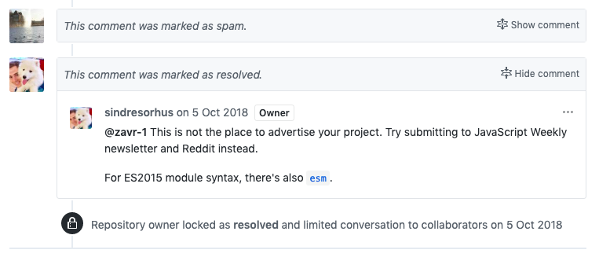

##! A Sad Spammer Is All I Am

In October, I was casually browsing the web and found out about the recent release of React, where the link was posted to [an issue on GitHub](https://github.com/sindresorhus/ama/issues/446) that relates to ES5 transpilation. In there I saw:

<row mb-3 class="markdown-body">
  <col sm-1>
    
  </col>
  <col border-radius="3px" py-0 margin-right="15px" border="1px solid #e1e4e8!important">
    <table>
      <tr>
        <td class="timeline-comment-header">
        [sindresorhus](https://github.com/sindresorhus) commented on 20 Feb 2017
        </td>
      </tr>
      <tr><td p-3>
      While most of my modules also work in the browser, I make them mainly for Node.js. I love how dependencies in Node.js just work (1) without having to resort to a bundler, compile-step, and a huge config file. ... The web on the other hand is a mess.  ... It would also be hard for individual packages to know what Babel (2) config to use.
      </td></tr>
    </table>
  </col>
</row>

2 things to take away:

<ul>
  * Although <code>import</code> is a language feature since 2015, many people, including top Node.JS Open Source developers, use `require` because it just works. This is also true for other packages such as Koa, Express, _etc_.
  * Babel IS de-facto what powers the web and you know that, you can't live without Babel.
</ul>

For me, keeping using `require` is not a solution when I can see how pretty <code>imports</code> are. It's like still using callbacks/promises when you can use async. Why should we all be limited in expressing ourselves using the richness of our language only because of outdated infrastructure that we have?

So I commented on the post, "Epic I don't want to transpile anything as I also write for Node :P *@sindresorhus* you can use import and export in your packages without Babel by installing my regex-based transpiler alamode: https://github.com/a-la/alamode! It's super-fast, has a require hook and works without building any AST! You can even debug with no problems." Then I explained the bug in _Babel_.

  

That really ticked me off. If I was a revered _Node.JS_ star, and somebody commented on one of my issues on GitHub, showing how _Babel_ is destroying JSDoc, I think I would have been like "Oh OK thank you, I'll probably keep using <code>require</code> but thanks for heads up!". It was then that I remembered I was doing all this work for MYSELF, not for anyone. The work I've done is always for my company first, but I also want to help people move in the right direction (~Type~JavaScript direction). This is why all code is Open Source, but under Affero.

<row color="#332725" background="#dfe7ef" border-radius="5px" margin="0" overflow="hidden" mb-3>
  <col md-7 p-3 class="order-2 order-md-1" d-flex align-self-center>
    <block-quote class="Quote" mb-0>
      The terrible suffering of the higher person, and the herd morality that encourages the alleviation of suffering, means they often come to ruin ([§269](http://cw.routledge.com/textbooks/alevelphilosophy/data/A2/Nietzsche/NietzscheNobility.pdf)). They need to forget what they know about life and themselves, their contempt and revulsion; and so they become seduced by flattery and lose their nobility to become someone ‘great’, revered by the herd.
      <!-- 
 -->
    </block-quote>
  </col>
  <col md-5 class="order-1 order-md-2" padding-left=".1px" padding-right="0" d-flex flex-column>
    
  </col>
</row>

Professional Open Source is a noble enterprise as it's run by creative specialists who know how to do their job well. Art Deco™ is a professional Node.JS company so to meet our own standard of the highest grade, we created _NodeTools_. Any healthy business needs to generate revenue, and to be competitive, one needs to be productive. Unlike mainstream Open Source that prides itself on popularity while not taking any responsibility for the lack of quality, our software is professional software. We don't do it for your stars. We do it for our business ops and to help those who choose to get into web computing to learn the art of Software Engineering.

<section-break />