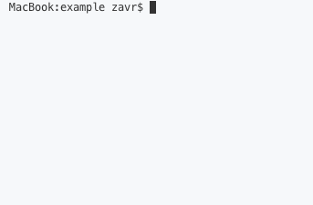
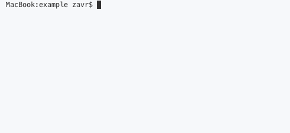

##! Conclusion

To quickly sum up, it's time to debunk myths that

<ul>
  - Open Source means software that comes for free instead of software that encourages freedom.
  - That all popular packages are good packages
  - and that JavaScript is deficient because it misses types.
</ul>

Truly free software is the one that cares about you as a developer by honestly attempting to show as little of its presence as possible and letting you do your job rather than dictating how you must work. 250 dependencies, complete negligence to documentation techniques and culture in which enormous bugs don't get fixed for years while maintainers travel around the world "moving JS proposals forward", might indeed make `Babel` _free_, but it only means something in the poser Open Source world.

Moreover, it is the fault of the official _Node.JS_ maintainer, ``NearForm``, who for [5 years](https://2ality.com/2014/09/es6-modules-final.html) could not add <code>imports</code> that we were under tyranny of _Babel_ and _TypeScript_. Standards don't code programs, people code programs, and we shouldn't create artificial constraints on ourselves that hamper the development process. All we want from an import in Node, is to take a function from a separate file. If risk is involved, then proper response mechanisms should be put in place instead of rejecting innovation. To quote Seneca: "It is not that we have a short time to live, but that we waste a lot of it" and we must use technology as our instruments to achieving our real goals, instead of worshipping the sacredness of our <ins>tools</ins>.

Another "free" software, _TypeScript_ is completely proprietary because you cannot go anywhere without `tsserver` binary. More and more code that you write in TypeScript, takes you further and further away from pure _JavaScript_. Microsoft does not prioritise fixing bugs that prevent proper functioning of _JSDoc_, such as that types from level 2+ files are not imported which results in poor experience for developers, their confusion and subsequent switch to _TypeScript_ typings. Moreover, instead of admitting the presence of such bugs in _VS Code_ IDE, Microsoft calls for developers to switch to _TypeScript_ to avoid issues. This is not *freedom* &mdash; it's nothing less than vendor lock-in and abuse of trust that developers put in.

I hope that on the other hand, my transpiler, [ÀLaMode](alamode) can match the criteria of free software because:

<ol>
* It has 0 dependencies, so that it will not waste developer time for linking of itself and future packages.
<table style="max-width:100%;">
<tbody><tr><th>ÀLaMode: 8 yarn.lock lines</th><th>Babel: 1650 yarn.lock Lines</th></tr>
<tr><td>

</td>
<td>

</td></tr>
</tbody></table>
* It does not change anything in source code apart from <code>import</code> and <code>export</code> statements, which looks exactly like a human would write it if they were writing it using require.
* It skips adding any _interop_s that force their own interoperability standard such as `__esModule` notation.
* It solves the problem of easily importing modules, without making a cult out of transpilation and ES6 modules specification.
* It preserves _JSDoc_, allows to debug programs using a source-map generation hack, and avoids constructing ASTs which is computationally much more expensive than using regular expressions.
* Regarding freedom, using _RegExes_ means that anyone can fork my project and make simple changes (e.g., implement unnamed imports such as `import 'example'`) with minimum effort/knowledge, i.e., there's no need to dive deep into compiler theories with its visitor patterns _etc_.
</ol>

There are some limitations to _ÀLaMode_, such as it currently does not transpile <code>import 'example'</code> or dynamic imports, or that it might not be able to handle `//` inside of template literals well, but those are minor bugs which are documented unlike the `Babel` bug that completely devastates the NPM infrastructure. To compensate for them, _ÀLaMode_ also allows to write `JSX` and can replace the locations of imports from <code>import t from 'package'</code> to <code>import t from '../stdlib/package'</code> to creation of 0-dependency packages via [stdlibs](quickStart#stdlib). As a company, we'll never hide behind the fact that we published our software for free, and will always respect our users' freedoms to build software how they want it.

<!-- end section -->
<section-break />

##! Comments

  <akashic-comments api-key="akashic" />

